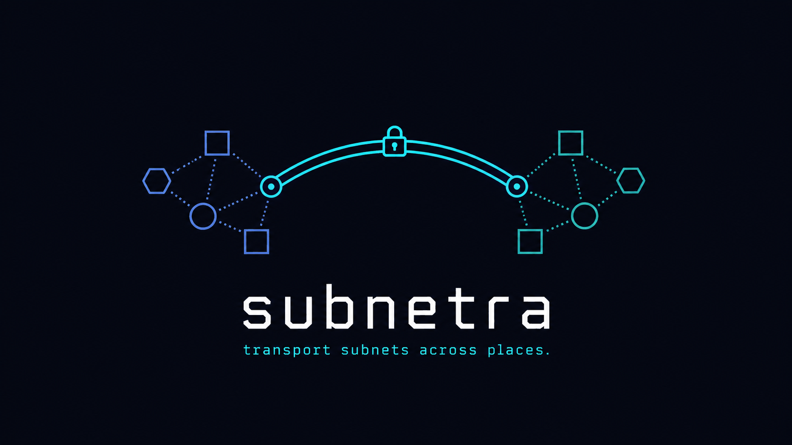

# Subnetra

**Connect your servers, sites, and devices into one private, encrypted network — shipped as a single tiny binary that runs anywhere, from a cloud VM to a MikroTik router.**

[](https://github.com/jamiesun/subnetra/actions/workflows/ci.yml)
[](https://github.com/jamiesun/subnetra/actions/workflows/release.yml)
[](https://github.com/jamiesun/subnetra/releases/latest)
[](LICENSE)

[](https://github.com/jamiesun/subnetra/releases/latest)

<p align="center">
  
</p>

## What is Subnetra?

Subnetra stitches machines in different places — offices, a data center, roaming
laptops, home labs, containers, routers — into a **single flat private subnet**.

It uses a **hub-and-spoke** design: a reachable **hub** relays traffic between
**spokes**, so any node can reach any other by a stable overlay IP **even when most
of them sit behind NAT**. Every packet travels **fully encrypted** over an ordinary
UDP tunnel, and the whole thing is **one self-contained binary** — nothing else to
install, no kernel modules, no daemon zoo.

## What you can do with it

- 🏢 **Link branch offices to a data center** — route whole subnets site-to-site over one private overlay.
- 💻 **Give roaming laptops a stable private IP** that follows them across Wi-Fi, LTE, and home networks.
- 🧪 **Reach home-lab / IoT / container services** as if they were on the same LAN.
- 🛰 **Publish a LAN from behind NAT** — e.g. a MikroTik router exposing `192.168.88.0/24` to the mesh.
- 📦 **Run where heavy VPN stacks won't fit** — constrained containers, BusyBox, small ARM boxes, edge routers.

## ✨ Highlights

- **Runs anywhere, installs as one file** — a single static binary (**under 512 KB** on
  Linux) with **zero external dependencies**. Drops onto cloud VMs, containers, BusyBox,
  Raspberry Pi, and **MikroTik RouterOS**. Builds for `amd64` / `arm64` / `armv7` / `armv5`,
  plus a native **macOS** spoke.
- **Encrypted by default, quiet on the wire** — every packet is ChaCha20-Poly1305
  encrypted with **per-link keys** and **replay protection**. There are no magic bytes, and
  unauthenticated packets are **dropped silently** — to a port scanner the tunnel looks like
  nothing is listening. **Header obfuscation is on by default** (`obfuscate`, mesh-wide): the
  20-byte framing header is XOR-masked per packet so the whole datagram looks random and the
  NAT keepalive cadence is de-periodized — no protocol fingerprint for a *passive* observer.
  Set `"obfuscate": false` to send a readable cleartext header (e.g. for packet-capture
  debugging), which a passive observer can then fingerprint. Obfuscation hides the protocol
  fingerprint, not packet length or timing. See [`docs/PROTOCOL.md` §3.4](docs/PROTOCOL.md).
- **A flat private subnet with policy routing** — give every node an overlay IP, route whole
  subnets site-to-site, and let the hub relay **spoke-to-spoke** so nodes behind NAT still
  reach each other.
- **Just works behind NAT** — spokes keep their own NAT pinhole open with a **built-in
  keepalive**, and the hub **automatically relearns** a spoke that roams to a new address —
  no external pinger, no manual reconnect.
- **Change routes live** — inject or update forwarding rules at runtime with **zero
  downtime**: no restart, no dropped packets.
- **Built to be operated** — human-readable **and** JSON status, per-reason drop counters
  that tell you *why* traffic isn't flowing, per-peer health/`online` flags, and a
  **Prometheus** exporter for alerting.
- **Simple, declarative config** — describe a node as a `hub` or a `spoke` and the
  forwarding table is derived for you. Name your peers so `status` reads
  `bj-office-gw`, not `id=2`.

## 🚀 Quick start

The fastest path is the container image (the hub is typically a public cloud host):

```bash
# 1. Create a config — one hub, one or more spokes.
cp config.example.json config.json
#    Set a UNIQUE 64-hex key on every peer link:  openssl rand -hex 32

# 2. Run it (the tunnel needs the TUN device + NET_ADMIN).
docker run -d --name subnetra \
    --cap-add=NET_ADMIN --device=/dev/net/tun \
    -v "$PWD/config.json":/etc/subnetra/config.json:ro \
    ghcr.io/jamiesun/subnetra:latest

# 3. Check it.
docker exec subnetra subnetra status
```

Prefer a bare binary? Grab the static build for your architecture from the
[**latest release**](https://github.com/jamiesun/subnetra/releases/latest), drop a
`config.json` next to it, and run `./subnetrad`. A full hub + two-spoke production
walkthrough lives in the [**deployment guide**](docs/deployment.md).

## ⚙️ Configuration at a glance

Set a `role` and Subnetra derives the routing table for you. A home/office **spoke**
that exposes its own overlay IP and sends everything else through the hub needs only:

```json
{
  "role": "spoke",
  "virtual_subnet": "10.0.0.0/24",
  "local_id": 2,
  "obfuscate": true,
  "local_tun_ip": "10.0.0.2/24",
  "local_routes": ["10.0.0.2/32"],
  "peers": [
    { "id": 1, "name": "cloud-hub", "endpoint": "203.0.113.1:18020", "allowed_src": "10.0.0.0/24", "psk": "…64 hex…" }
  ]
}
```

The matching **hub** just lists its spokes — each peer becomes a route to that node:

```json
{
  "role": "hub",
  "virtual_subnet": "10.0.0.0/24",
  "local_id": 1,
  "obfuscate": true,
  "peers": [
    { "id": 2, "name": "bj-office-gw", "endpoint": "203.0.113.2:18020", "allowed_src": "10.0.0.2/32", "psk": "…64 hex…" },
    { "id": 3, "name": "alice-laptop", "endpoint": "203.0.113.3:18020", "allowed_src": "10.0.0.3/32", "psk": "…64 hex…" }
  ]
}
```

> **Note:** the hub deliberately omits `local_tun_ip` — the derived table only
> forwards to spokes, so the hub is a pure relay that is *not* reachable on the
> overlay. Give it a `local_tun_ip` **and** a local-delivery rule only if you need
> to reach the hub itself.

Each peer link uses its **own** private pre-shared key (generate with `openssl rand -hex 32`);
sharing one key across links is rejected. Spokes enable the NAT keepalive automatically.
See [`config.example.json`](config.example.json) and the
[deployment guide](docs/deployment.md) for every field, and `subnetrad --check` to
validate a config offline.

## 📡 Operate & observe

`subnetra status` turns the silent, by-design packet drops into countable signals so
you can tell *why* traffic is or isn't flowing:

```text
subnetra v0.9.0 [running]
mode=raw_direct local_id=1 udp_port=18020 tun=snr0 peers=2
peers:
  id=2 name=bj-office-gw endpoint=203.0.113.2:18020 allowed_src=10.0.0.2/32
  id=3 name=alice-laptop endpoint=203.0.113.3:18020 allowed_src=10.0.0.3/32
traffic: tun_rx / udp_tx / udp_rx / tun_tx / relay / keepalive …
drops:   unknown_peer / auth_or_invalid / spoof / no_route …
```

- `subnetra status --json` emits the same data as a stable, versioned JSON object —
  including a per-peer `last_seen_age_seconds` and `online` flag — for monitoring and
  automation (secrets are never serialized).
- A drop-in **Prometheus** [textfile exporter](deploy/subnetra-textfile-exporter.sh)
  turns that into scrapeable metrics and alerts.

See [deployment guide §6–§7](docs/deployment.md) for the full status schema, the drop
taxonomy, and alerting examples.

## 🔌 Install options

| Target | How |
|---|---|
| **Container** (amd64 / arm64 / armv7 / armv5) | `docker pull ghcr.io/jamiesun/subnetra:latest` — ships a `HEALTHCHECK` so orchestrators report `healthy`/`unhealthy`. |
| **Static binary** | Download `subnetra-<version>-<arch>.tar.gz` from [Releases](https://github.com/jamiesun/subnetra/releases/latest) — no runtime to install. |
| **Air-gapped / offline** | Load the per-arch `docker load`-able image tarball attached to each release; verify against `SHA256SUMS.txt`. |
| **macOS spoke** | `subnetra-<version>-macos-arm64.tar.gz` (Apple Silicon) / `…-amd64` (Intel) — runbook-certified, see [`docs/macos-spoke-acceptance.md`](docs/macos-spoke-acceptance.md). |
| **MikroTik RouterOS** | Scripted container bring-up/teardown in [`deploy/routeros/`](deploy/routeros/) — see [`docs/routeros-container.md`](docs/routeros-container.md). |
| **systemd / launchd** | Ready-to-edit units and hub/spoke configs in [`deploy/`](deploy/). |

## 📚 Documentation & resources

- 📘 [**Deployment guide**](docs/deployment.md) — hub + two-spoke production walkthrough: secrets, host networking, upgrades, HA/failover, key rotation, monitoring.
- 📐 [**Wire-protocol spec**](docs/PROTOCOL.md) — the normative v1 on-wire contract (for interoperability and review).
- 🎛 [**Control-plane protocol**](docs/CONTROL-PROTOCOL.md) — the local UDS API to manage/monitor a running daemon from any language (no FFI).
- 🍏 [**macOS spoke runbook**](docs/macos-spoke-acceptance.md) · 🛰 [**RouterOS container guide**](docs/routeros-container.md)
- 🏗 [**Design & architecture**](docs/subnetra-develop.md) — the PRD and system design.
- 🗺 [**Roadmap & acceptance matrix**](docs-site/en/src/reference/roadmap.md) — what ships, what never will, and the capability coverage matrix every feature must satisfy.
- 📦 [**Releases**](https://github.com/jamiesun/subnetra/releases/latest) · 🐳 [**Container image**](https://github.com/jamiesun/subnetra/pkgs/container/subnetra) · ⚙️ [**Example config**](config.example.json)

## 🛠 Build from source

Requires the [Zig](https://ziglang.org/) 0.16.0 toolchain — nothing else.

```bash
zig build                                   # native build
zig build -Dtarget=aarch64-linux-musl       # static cross-compile (also: x86_64 / arm-*)
zig build test                              # run the test suite
```

Artifacts land in `zig-out/bin/` (`subnetrad` daemon + `subnetra` control tool). A
Linux dev container and integration/benchmark harness live under
[`.devcontainer/`](.devcontainer/) and [`test/integration/`](test/integration/);
releases are cut by bumping `.version` in [`build.zig.zon`](build.zig.zon) and pushing
a matching `vX.Y.Z` tag.

**Quality & acceptance:** every top-level capability is tracked in the
[**acceptance matrix**](docs-site/en/src/reference/roadmap.md#acceptance-matrix-capability-coverage-matrix)
with a hard coverage floor — a Happy-Path E2E per capability, a failure path for
high-risk ones, two-role checks on permission surfaces, recovery/rollback for
state-mutating operations, and a new E2E + matrix row with every new capability
([`AGENT.md` §6](AGENT.md)).

## 📄 License

[MIT](LICENSE) © 2026 jettwang
